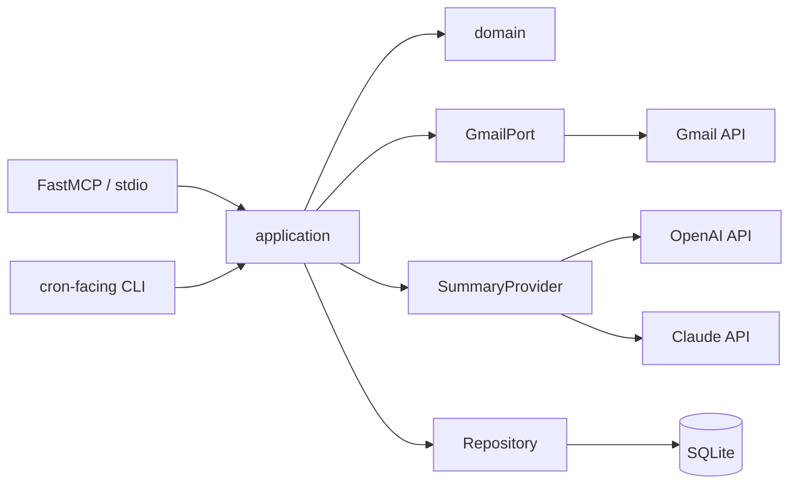
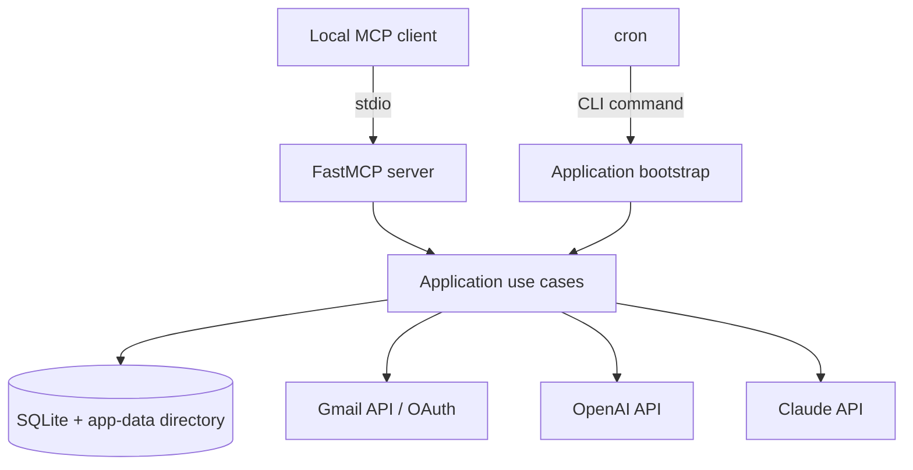

# Architecture Spine — Usługa MCP dla Gmaila

## Design Paradigm

**Hexagonal (Ports-and-Adapters).** `application/` owns use cases and Ports; `domain/` owns validated values and no SDK imports. `adapters/` implement ports for MCP, Gmail, OpenAI, Claude, SQLite, cron-facing CLI and local files. `bootstrap/` is the only composition root.



## Invariants & Rules

### AD-1 — Dependency direction

- **Binds:** all modules
- **Prevents:** Gmail, MCP, SQLite or AI SDK types leaking into use cases and tests.
- **Rule:** Dependencies point inward: adapters depend on application/domain Ports; application depends on domain and Ports; domain has no adapter or SDK dependency.

### AD-2 — Local MCP boundary

- **Binds:** FR-6, FR-7, FR-8, NFR-3
- **Prevents:** an accidental REST/Flask surface, remote exposure or a write-capable MCP tool.
- **Rule:** FastMCP exposes only `get_daily_digest`, `summarize_gmail` and `compare_summaries` through local `stdio`; all tool handlers delegate to application use cases and declare no Gmail mutation capability.

### AD-3 — Single writer of local state

- **Binds:** FR-3, FR-5, FR-7, FR-10, NFR-4
- **Prevents:** cron and MCP requests creating duplicate summaries, costs or conflicting state.
- **Rule:** One application write service owns SQLite mutations; cron-facing CLI and MCP invoke it through the same use cases. A per-account local lock guards each analysis run.

### AD-4 — Data and secret boundary

- **Binds:** FR-1, FR-10, NFR-1, NFR-5
- **Prevents:** secrets or mail bodies entering SQLite, logs or Git.
- **Rule:** AI keys come only from process environment or local `.env`; OAuth token, SQLite database and digests live in the user-only application-data directory. `credentials.json`, `.env`, token files and application data are Git-ignored. Logs contain IDs, status and technical error metadata only.

### AD-5 — Gmail read and filter enforcement

- **Binds:** FR-1, FR-2, FR-3, FR-8, NFR-3
- **Prevents:** scope expansion, message-level duplicate processing and comparison outside the permitted mailbox subset.
- **Rule:** GmailAdapter uses `gmail.readonly` and returns thread-first candidates only. The saved Active Gmail Filter bounds scheduled work and comparisons; one-off `summarize_gmail` filters are previewed and confirmed, and never mutate the Active Gmail Filter.

### AD-6 — Provider-neutral summaries

- **Binds:** FR-4, FR-8, FR-9, NFR-2
- **Prevents:** provider-specific response shapes or silent OpenAI/Claude fallback.
- **Rule:** `SummaryProvider` returns `ThreadSummary` schema version `1`: summary (max three sentences), priority (`wysoki`/`średni`/`niski`), actions, provider and result status. OpenAI is the default provider; configured OpenAI or Claude serves Digest and `summarize_gmail`. `compare_summaries` calls both only after explicit confirmation. Provider errors remain explicit per provider.

### AD-7 — State and result truthfulness

- **Binds:** FR-3 through FR-10, NFR-2
- **Prevents:** stale, partial or failed analyses being presented as complete.
- **Rule:** Persisted runs and tool responses carry `complete`, `partial` or `failed`, generation time, covered time range and reason. A thread is eligible again only after a new message or after newly matching the Active Gmail Filter; explicit reanalysis is separately requested.

### AD-8 — Local retention

- **Binds:** FR-10, NFR-1
- **Prevents:** indefinite accumulation of summaries and metadata.
- **Rule:** SQLite persists only Gmail IDs, content hashes, metadata, run state and validated summaries. A cleanup use case removes Digests and Thread Summaries older than 30 days; full bodies and attachments are never persisted.

### AD-9 — Consent binds to an input snapshot

- **Binds:** FR-7, FR-8, FR-9, NFR-1, NFR-3
- **Prevents:** a confirmed request fetching a different Filter, Thread set or provider than the user reviewed.
- **Rule:** Preview creates a short-lived, single-use confirmation token bound to operation, filter hash, ordered thread IDs, provider(s) and normalized AnalysisInput hash. Execution requires that token; an expired or mismatched token returns `failed` without Gmail or AI calls. The configured provider is included in the snapshot; `compare_summaries` binds both providers.

### AD-10 — Analysis run and deletion protocol

- **Binds:** FR-1, FR-3, FR-5, FR-10, NFR-2, NFR-4
- **Prevents:** duplicate processing after interruption, a stale lock, or disconnect/deletion racing an analysis run.
- **Rule:** Write service creates an AnalysisRun with immutable input snapshot and state `running`/`complete`/`partial`/`failed`; transactionally claims candidate threads before AI calls and records the terminal state. Disconnect or user deletion first prevents new runs, then idempotently deletes OAuth token and requested local state under the same account lock.

### AD-11 — Reproducible build seed

- **Binds:** all implementation units
- **Prevents:** incompatible dependency resolution or accidental upgrade to MCP SDK v2 pre-release.
- **Rule:** `pyproject.toml` declares constraints, `.python-version` pins Python `3.12`, and committed `uv.lock` is the sole exact dependency resolution; CI and local verification use `uv sync --locked`. MCP remains on stable v1 (`>=1.27,<2`) until a separately approved migration.

## Consistency Conventions

| Concern | Convention |
| --- | --- |
| Naming | Domain entities use singular PascalCase; ports end in `Port`; adapter implementations end in `Adapter`; use cases are verb-first. |
| Data & formats | IDs are opaque strings; timestamps are UTC ISO 8601; tool responses use a top-level `status`, `data`, `reason` envelope. |
| State & cross-cutting | Only application use cases mutate repositories; adapters translate external errors to typed application errors; body text is excluded from logs. |
| Configuration | Settings are loaded once in `bootstrap/`; no module reads environment variables directly. |
| Consent | Preview/confirm uses the single-use token defined by AD-9; tool calls cannot supply raw body text. |
| Tests | Domain/application tests use fakes for Ports; adapters use contract/integration tests with recorded non-sensitive fixtures. |

## Stack

| Name | Version |
| --- | --- |
| Python | `3.12` |
| uv | current; committed `uv.lock` owns exact versions |
| MCP Python SDK / FastMCP | `>=1.27,<2`; exact v1 resolution in `uv.lock` |
| Google API Python client | `2.198.0` |
| google-auth-oauthlib | `1.4.0` |
| OpenAI Python SDK | `2.38.0` |
| Anthropic Python SDK | `0.117.0` |
| SQLite | platform SQLite via Python standard library |
| Scheduler | local operating-system cron invoking the CLI |

## Structural Seed



```text
src/gmail_mcp/
  domain/        # values and ThreadSummary contract
  application/   # use cases and Ports
  adapters/      # Gmail, AI, SQLite and FastMCP implementations
  bootstrap/     # settings, dependency wiring and CLI entry points
tests/
  unit/          # domain/application tests with fakes
  integration/   # adapter contracts and sanitized fixtures
docs/
  architecture/  # C4 portfolio diagram
```

## Capability → Architecture Map

| Capability / Area | Lives in | Governed by |
| --- | --- | --- |
| OAuth and Gmail filters | GmailAdapter + connection/filter use cases | AD-4, AD-5 |
| Digest and deduplication | digest use case + Repository | AD-3, AD-7, AD-8 |
| MCP tools | FastMCP adapter + use cases | AD-2, AD-7 |
| AI summaries and comparison | SummaryProvider adapters + summary use case | AD-5, AD-6 |
| Status, retention and deletion | application use cases + Repository | AD-3, AD-7, AD-8, AD-10 |
| Preview and confirmed analysis | MCP adapter + application use cases | AD-5, AD-6, AD-9 |

## Deferred

- HTTP/Streamable HTTP transport and remote hosting: local `stdio` satisfies MVP; revisit for deployment.
- Multi-account tenancy and organization-level OAuth: out of MVP and requires separate privacy/security design.
- Encryption at rest beyond user-only local file permissions: defer until a threat model requires it.
- Automatic provider selection, background model evaluation and prompt experimentation: product-level improvements after MVP quality validation.
