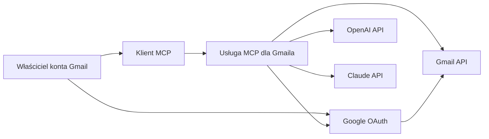
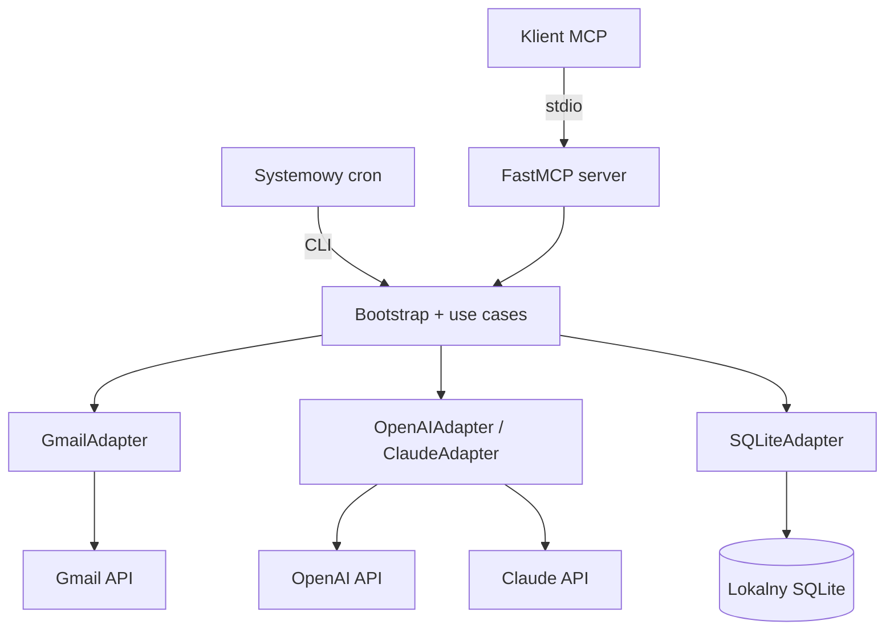

# Usługa MCP dla Gmaila — diagram C4 do portfolio

## Poziom 1: Context

Lokalna usługa MCP pobiera wyłącznie dozwolone Wątki Gmaila, tworzy Digesty i Podsumowania Wątków przez OpenAI, a Claude wykorzystuje wyłącznie do ręcznego porównania pojedynczego Wątku. Klient MCP otrzymuje tylko ustrukturyzowane wyniki oraz status kompletności.

## Poziom 2: Container

Granice demonstratora:

- FastMCP używa lokalnego transportu `stdio`; nie ma publicznego endpointu HTTP.
- Systemowy cron i serwer MCP korzystają z tych samych przypadków użycia.
- SQLite przechowuje metadane, hashe, statusy i podsumowania maksymalnie 30 dni.
- Token OAuth i klucze AI nie są przekazywane klientowi MCP ani zapisywane w repozytorium.
